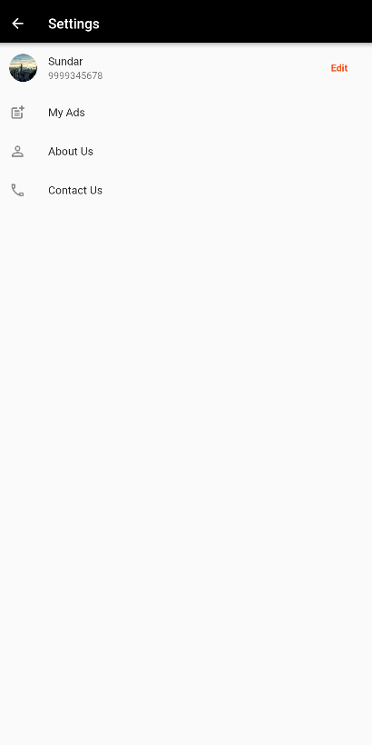

# ui_practice

| Name          | Career Path |                         e-mail |
| ------------- | :---------: | -----------------------------: |
| Estrella Poot |   Flutter   | Estrella.Poot@itksquare.edu.mx |

# Quick start using chrome

```bash
flutter run -d chrome --web-renderer html
```

### 1) Login Screen


### 2) Register Screen


### 3) Home Screen


### 4) Settings Screen



### 5) Edit Profile Screen


### 6) My Ads Screen


### 7) Edit Ads Screen


### 8) Product Detail Screen


### 9) Create Ad Screen


### 10) Image Viewer Screen


